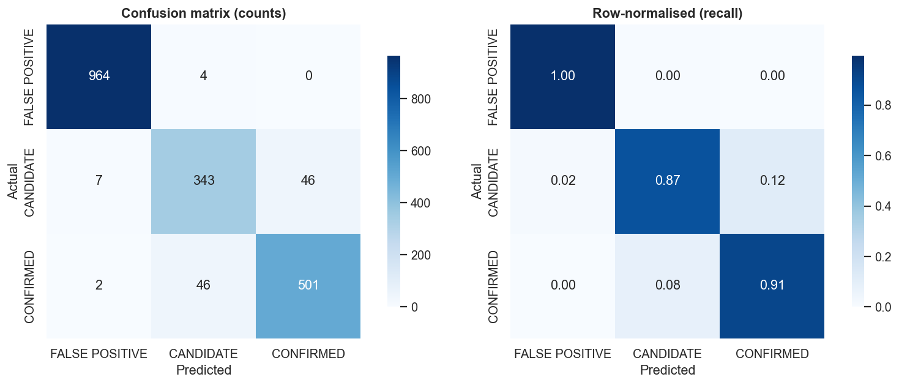

# 🌌 Hunting Exoplanets with Machine Learning

**Classifying NASA Kepler Objects of Interest — CONFIRMED · CANDIDATE · FALSE POSITIVE**

Submission for the **India High School Exoplanet Data Challenge** (Celesta × NASA Exoplanet Archive).

When a planet crosses in front of its star, it blocks a sliver of starlight — a *transit*. NASA's Kepler telescope
watched ~200,000 stars for these dips, but most are impostors (eclipsing binaries, noise, blends). This project
builds a machine-learning model that reproduces expert triage of 9,564 Kepler Objects of Interest directly from
their transit and stellar measurements.

## 🏆 Headline result

| Metric | Score |
|---|---|
| **Macro-F1 (5-fold CV)** | **0.928 ± 0.007** |
| Accuracy (5-fold CV) | 0.947 ± 0.005 |
| Best model | XGBoost (3-class) |

FALSE POSITIVE recall ≈ **99%**; nearly all remaining error is the *scientifically irreducible*
CANDIDATE↔CONFIRMED boundary (see the write-up for why).



## 📂 Repository contents

| File | What it is |
|---|---|
| [`exoplanet_classification.ipynb`](exoplanet_classification.ipynb) | **Main deliverable** — the full, reproducible notebook (EDA → leakage audit → feature engineering → modelling → explainability → report) |
| [`REPORT.md`](REPORT.md) | Standalone written report (~680 words) |
| [`requirements.txt`](requirements.txt) | Pinned dependencies |
| `Dataset/` | The KOI cumulative CSV + official data guide |
| `figures/` | All generated plots (regenerated on every run) |

## 🚀 Reproduce it

```bash
pip install -r requirements.txt
jupyter notebook exoplanet_classification.ipynb   # Run → Run All Cells
```

Everything is seeded with `random_state=42`, so every number and figure regenerates exactly. The notebook is
self-contained — it depends only on the CSV in `Dataset/`.

## 🔬 What makes this submission different

1. **A real leakage audit.** Beyond the `koi_score` the organisers removed, we found and removed `kepler_name`
   (only confirmed planets are named) and `koi_pdisposition` (the pipeline's own answer). We then *measured* the
   Robovetter flags' contribution instead of silently relying on them.
2. **Domain-aware feature engineering.** Fractional measurement uncertainties, log transforms, and physics
   consistency features like `depth_consistency` (observed vs. radius-implied transit depth) — several of which
   SHAP confirms are top predictors.
3. **Honest science.** The model shows that false-positive rejection is nearly solved, while CONFIRMED-vs-CANDIDATE
   is a genuine limit of photometry — a candidate is just a planet no one has confirmed *yet*.

## 📊 Method at a glance

```
9,564 KOIs × 140 cols
   │  drop 19 empty + ID/leakage/metadata columns
   │  engineer 20+ physics features (frac-errors, logs, consistency ratios)
   ▼
77 numeric features
   │  stratified 80/20 split  +  5-fold CV
   ▼
LogReg → RandomForest → HistGradientBoosting → XGBoost ✅
   │  explain: gain importance · permutation importance · SHAP
   ▼
macro-F1 = 0.928 ± 0.007
```

---

*Data: NASA Exoplanet Archive — Kepler KOI Cumulative Table (DOI 10.26133/NEA4), provided by the NASA Exoplanet
Science Institute at IPAC/Caltech. Challenge organised by Celesta.*
